Below are the different functionality and screens of web application

Login Page

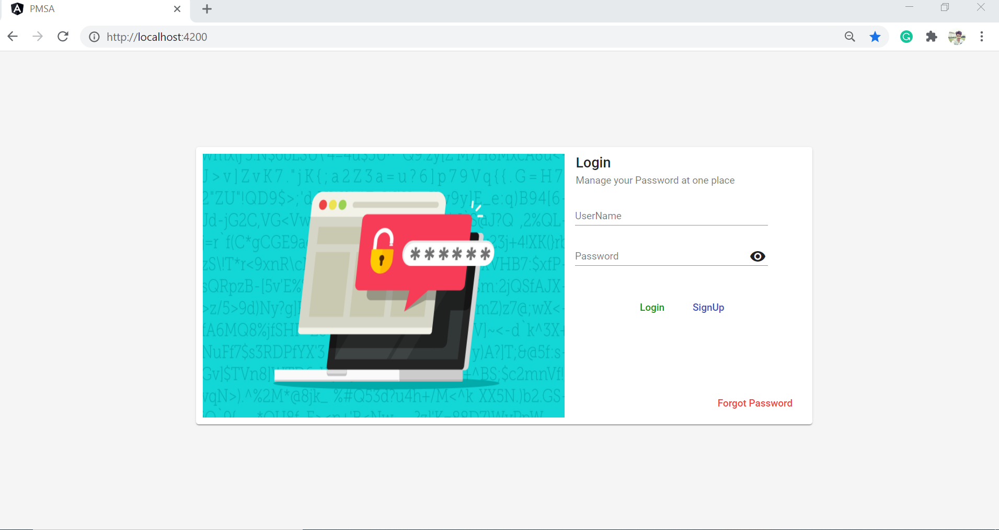

SignUp Page

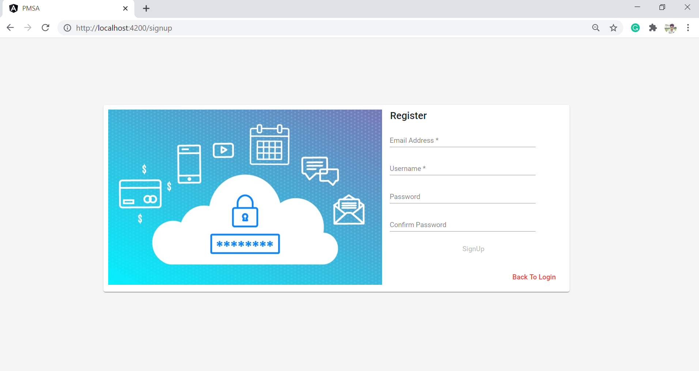

Forgot Password Page

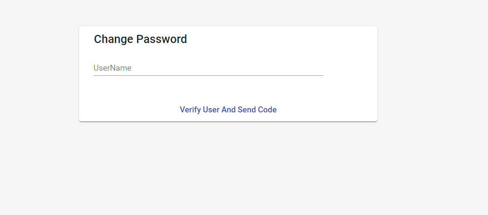

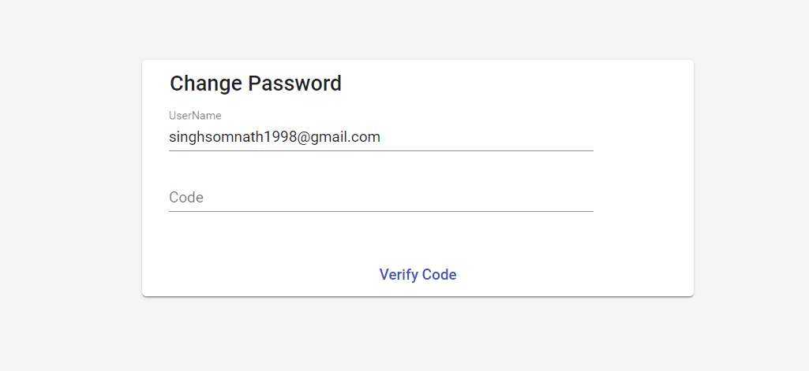

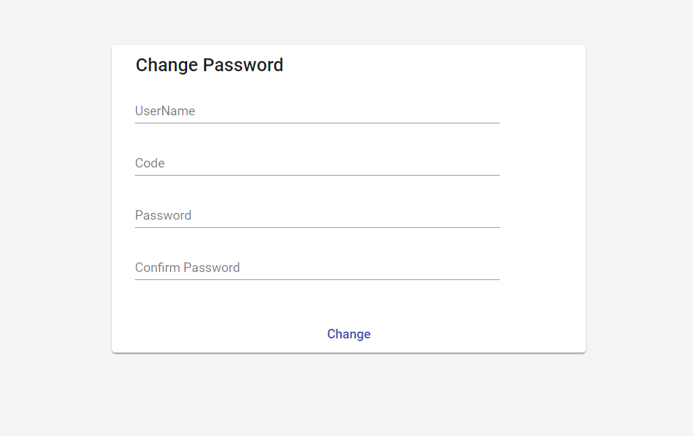

DashBoard

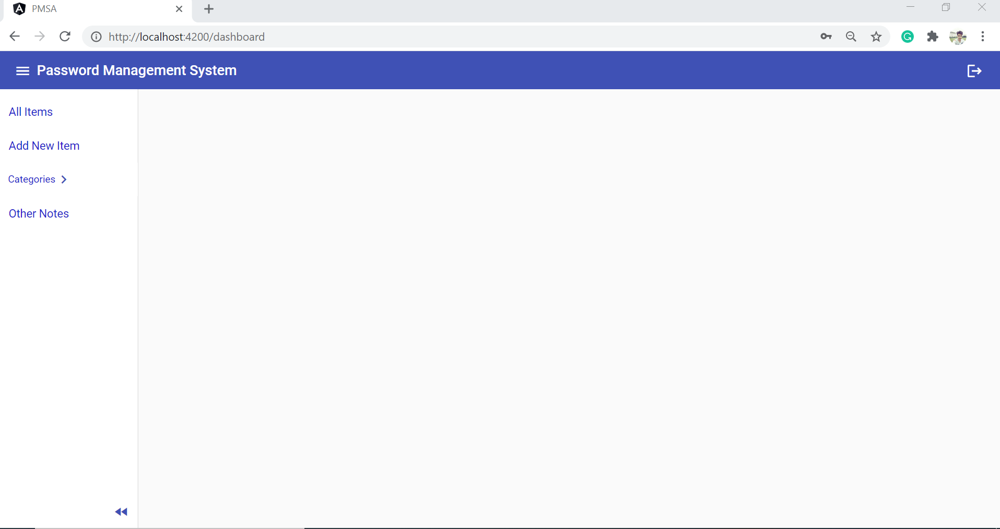

DashBoard All-Items Page

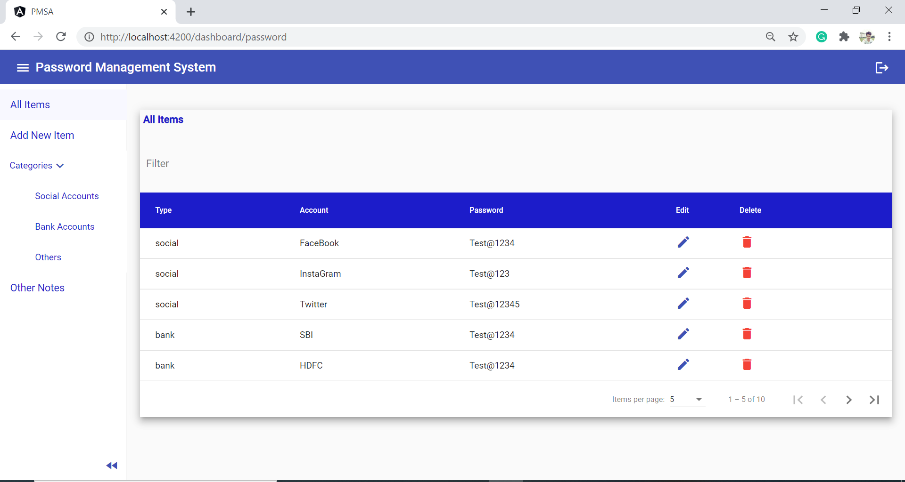

Add New Item

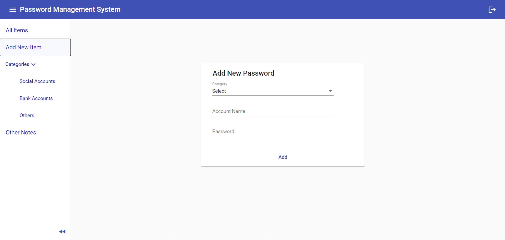

Edit Items

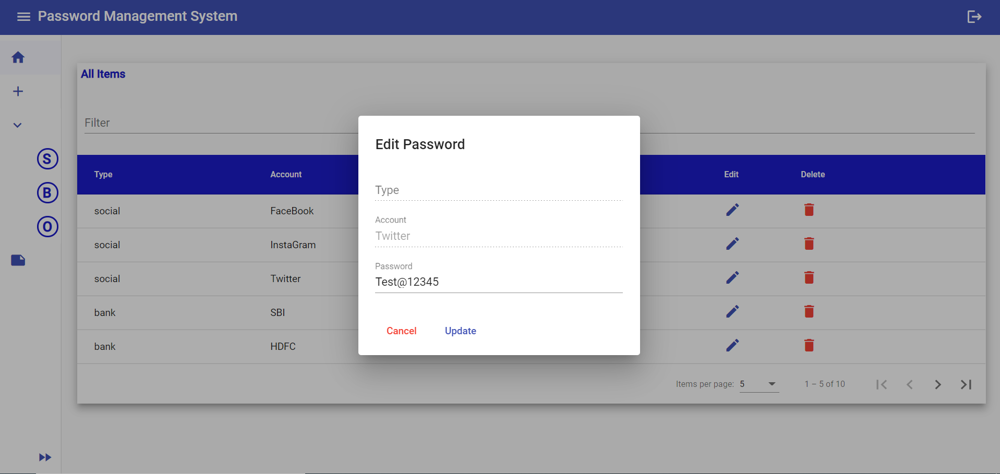

Delete Items

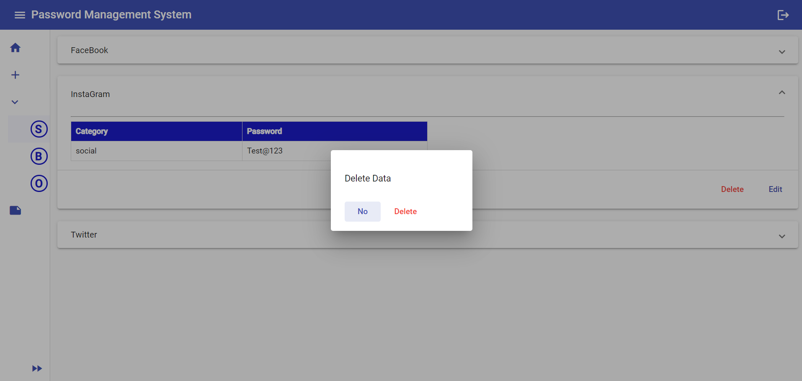

Social Categories Stored

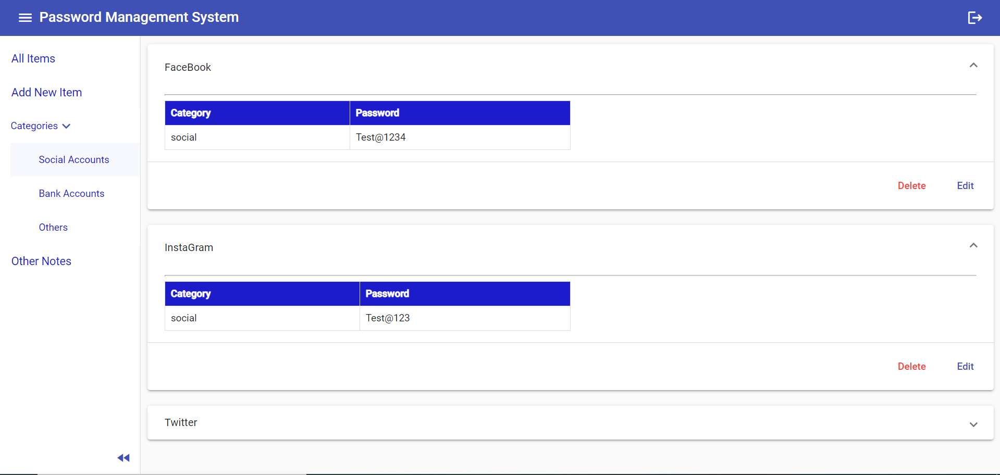

Banks Data Stored

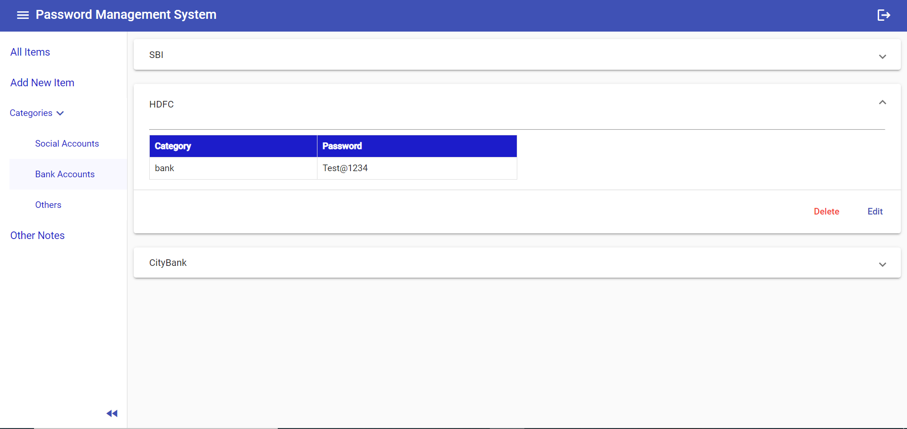

Others Password Stored

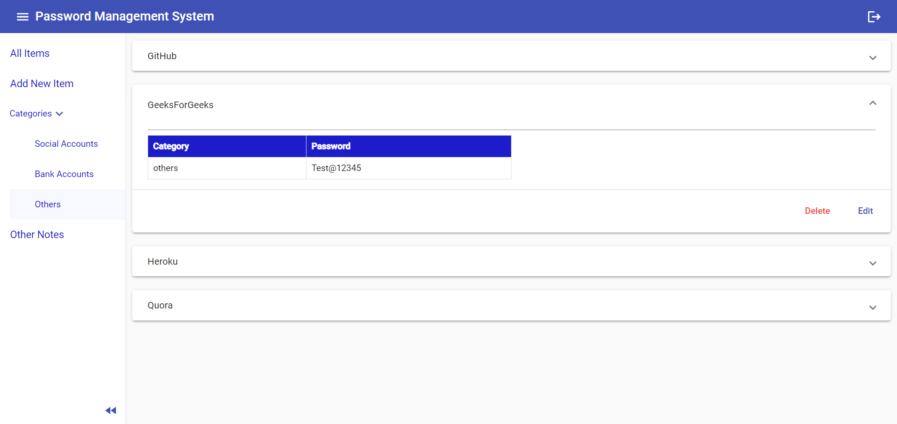

Notes

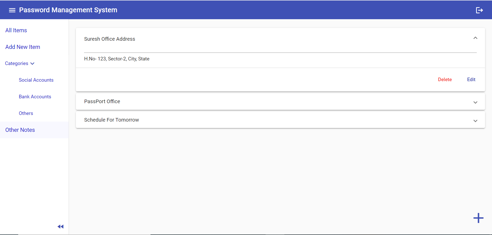

Half Close Side Navigation

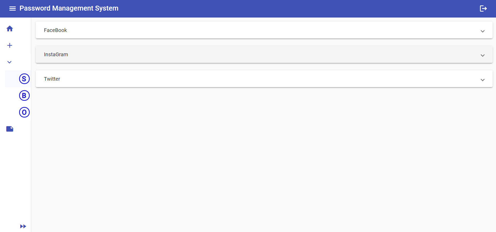

Have a good day !
